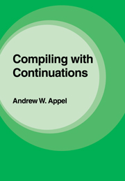

# Compiling with Continuations

[_Compiling with Continuations_ by Andrew W. Appel](https://doi.org/10.1017/CBO9780511609619), 
published by Cambridge University Press, 1992, is a classic text in the area
of compiler construction. It describes the backend of the Standard ML of New Jersey 
compiler, which uses the _continuation passing style_ (CPS) compilation 
strategy.

The implementation language used in the book is also ML. This repository is 
an alternative implementation in Rust. Effort was made to stay as close to 
the book as was reasonable. Because Rust is in some sense a strict 
superset of ML, most of the data structures translated with only minor 
syntactic changes. Some of the names have been changed for increased clarity. 

# Appel/ML vs. Me/Rust

Some notes on analogous types and data structures between this code and 
\[Appel] are collected here.

## CPS Semantics Representation

| Name         | ML Item                 | ML Type                                                      | Rust Item   | Rust Type                                                    |
| ------------ | ----------------------- | ------------------------------------------------------------ | ----------- | ------------------------------------------------------------ |
| Value        | Value                   | `datatype value = VAR of var` | `LABEL of var` | `INT of int` | `REAL of string` | `STRING of string` | `Value`       | `enum Value{ Variable(Variable), Label(Variable), Integer(Integer), Real(Real), String(String) }` |
| Values       | -                       | -                                                            | `ValueList` | `Vec<Value>`                                                 |
| Continuation | Continuation Expression | `CExp`                                                       | `CExp`      |                                                              |
|              |                         |                                                              |             |                                                              |
|              |                         |                                                              |             |                                                              |

## Denotation Representation

| Name                      | ML item                                              | ML type                                | Rust item                                                    | Rust type                                                    |
| :------------------------ | :--------------------------------------------------- | :------------------------------------- | :----------------------------------------------------------- | :----------------------------------------------------------- |
| Denotable Values          | `dvalue list`                                        | `dvalue list`                          | `DValueList` / `DenotableValueList`                          | `Vec<DenotableValue>`                                        |
| Parameters                | -                                                    | -                                      | `Parameters`, wrapper for `DValueList`                       | `Rc<DValueList>`                                             |
| Store                     | `store`: (*next unused, value store, integer store*) | `loc * (loc -> dvalue) * (loc -> int)` | `Store`                                                      | `struct Store{ next_unused_address: Location, current_exception_handler: Location, values: DenotableValueList, integer_values: IntegerList }` |
| Continuation              | `dvalue FUNC`                                        | `dvalue list -> store -> answer`       | `RawContinuation`                                            | `dyn Fn(Parameters, Store) -> Answer`                        |
| Continuation              | -                                                    | -                                      | `Continuation` / `DenotableFunction`, wrapper for `RawContinuation` | `pub struct Continuation{pub f: Rc<RawContinuation>}`        |
| Answer                    | Curried continuation: `f [p1 p2 ...]` (no store)     | `store -> answer`                      | `Answer`                                                     | `pub struct Answer {f: Rc<RawContinuation>,   parameters: Parameters}` |
| Current Exception Handler | Global variable                                      | `val handler_ref : loc`                | Member of `Store`                                            | `struct Store{ current_exception_handler: Location, ... }`   |
|                           |                                                      |                                        |                                                              |                                                              |

`ContinuationExpression` evaluates to `Continuation` (`DenotableFunction`) evaluates to  `Answer`.

# License and Authorship

Copyright (C) 2022 Robert Jacobson. This software is distributed under the MIT 
license or the Apache license at your option. See [MIT.txt](MIT.txt) and 
[APACHE.txt](APACHE.txt).

The book [_Compiling with Continuations_ by Andrew W. Appel](https://doi.org/10.1017/CBO9780511609619) is 
Copyright (C) 1992 Cambridge University Press. Quotations from this work are 
included herein under the "fair use" exceptions of Section 107 of the 
Copyright Act.

[Standard ML of New Jersey](https://www.smlnj.org/) 
is Copyright (c) 2001-2020 by The Fellowship of SML/NJ and
Copyright (c) 1989-2001 by Lucent Technologies. No code
from Standard ML of New Jersey was used in this project.
